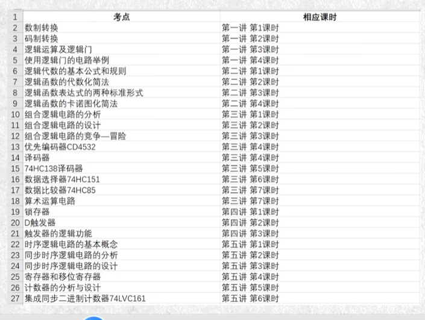

# 第一部分 元器件绘制

## 第1课课程介绍及学习思路介绍

### 1.2.学习思路

#### 学什么

- AD软件
- 电子设计：原理图（原理图库、原理图绘制）、PCB设计
- PCB布线、PCB布局）

#### 怎么学

- 软件怎么学习:每天几个操作练习快捷键50遍
- 电子设计怎么学：看、练、对比学习

## 第2课AD20的软件安装

## 第3课AD的工程组成及创建

### 3.1 工程创建

先新建工程（类似文件夹，里面有各种内容,是最先建立的如果不新建工程后续内容无法关联；一定要工程的基础上，去建立库和图，不然Free Document下，难以链接和管理）,列表中的选项，是各种demo，一般直接default

> - 创建原理图库（元件库）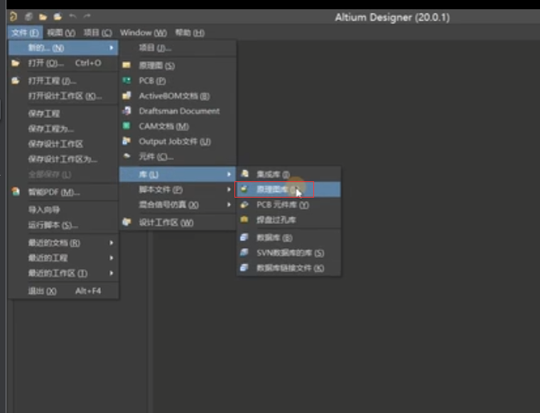
>
> - 创建时不会自动保存空文件，CTRL+S保存、命名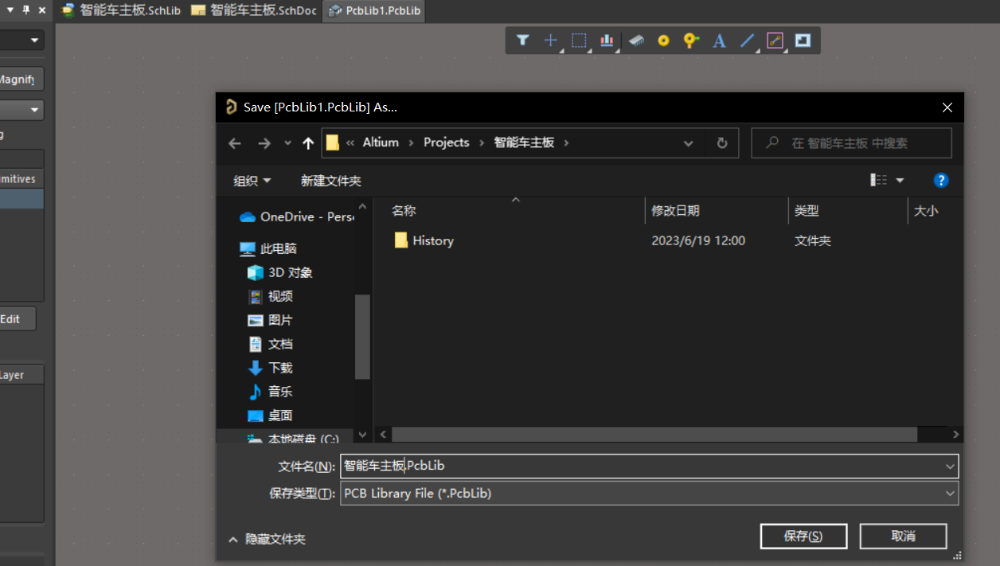
>
> - 新建原理图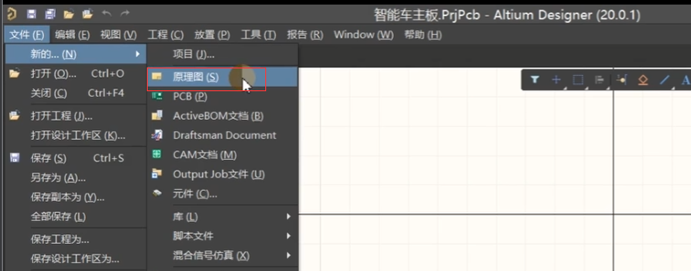
>
> - 创建PCB库
>
>   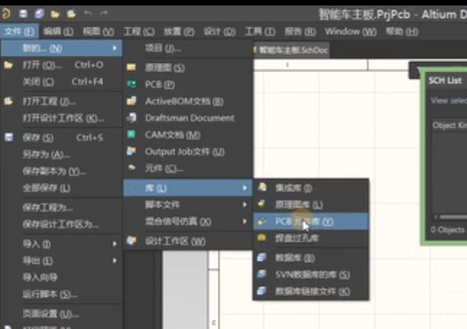
>
> - 新建PCB

### 3.2 工程内容

> PCB（Printed Circuit Board）是一个电路板，它是由导电材料制成的，用于支持和连接电子元件。原理图（Schematic Diagram）**是一种图形表示方法，用于描述电路中各个元件之间的连接关系和工作原理**。可以说，PCB是电子电路的物理实现，而原理图则是电子电路的逻辑描述。

- 原理图库：绘制出芯片、元件模型
- 原理图：把原理图库里的原件连接、连线
- PCB库：同理于原理图库，原理图和PCB桥接的桥梁。和PCB实物尺寸是对应的，因此一定要比较精准。
- PCB图：PCB布局布线
- 其他生成文件

 PCB库(模型)

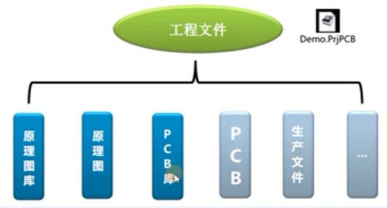

## 第4课元件库介绍及电阻容模型的创建

### 4.1元件模型

**元件**

- 新建元件，定义其属性 双击或按编辑进行属性定义

元件图的内涵：元件库 要包含**元件边框、管脚（序号和名称）、元件名称、元件说明**

元件图**和实物尺寸不对应和PCB封装有区分，和Multisim相似**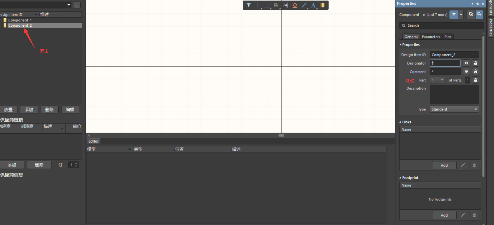

### 4.2 画一个电阻

- 放管脚，放的过程中按Tab或者放之后双击 都可以进入管脚编辑（Designator 位号 Name 管脚名称 Symbol栏设置形状，不改变性能，只是从符号上进行说明），为了美观隐藏Name
- **管脚上四个白点：有电气属性，朝向电阻外部，管脚两端是不同的**;连接点一定要朝外
- 按空格旋转图形90°

- 画出电阻形状（边框）：绘制线，同样双击后可以修改属性
- **绘制精度：网格边长是100mil，设置捕捉点的尺度：视图→栅格→设置捕捉栅格（绘制建议设置10mil，放置建议设置1 00mil）**（对格点的长度进行调整）
- 复制的快捷操作：选中一些目标，按住Shift拖动
- 元件描述：元件属性中的Description描述，Link放置链接（如网址等）
- 电阻的**位号一般写R?，原理图绘制的最后再进行统一位号排序（R1，R2...）**
- 封装：Footprint，PCB的封装，可以在原理图绘制好之后，根据实际情况统一去加。现在就加的话，在下面Editor的Add Footprint增加（元器件的选型）

## 第5课IC类元件模型的创建

## 第6课排针类元件模型的创建

## 第7课光耦及二极管元件模型的创建

## 第8课现有元件模型的调用

从别人的库里面复制粘贴对应的元器件到自己的库中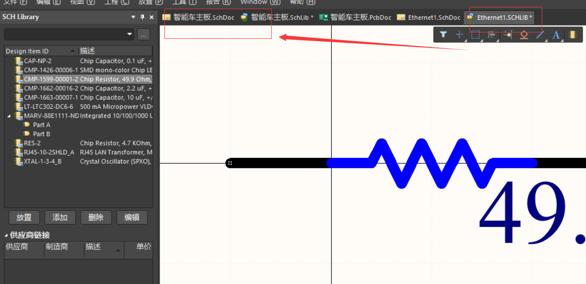

# 第二部分 原理图绘制及编译检查

## 第10课元件的放置

1. 可以选择一个一个元器件放置也可以一起操作

2. **绘制原理图**

   - 右下角Panels→Components，会显示自带的库和自己的库

   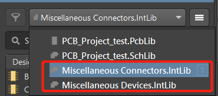

   - 放置器件快捷操作：直接拖动出来
   - 一般把所有需要用到的元件先全拖出来（不考虑个数）

## 第11课器件的复制及对齐

目标

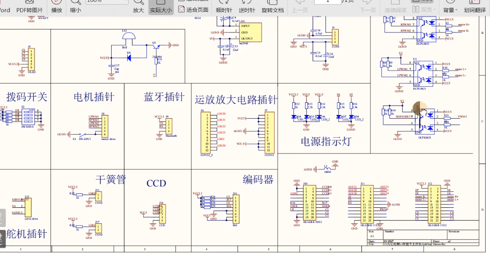

基于模块进行复制

- 设置纸张大小：Panels→Properties→Sheet Size
- 复制：框选后按住Shift拖动
- 多个器件对齐：框选→快捷键A 要关掉输入法
- 原理图模块分区：**放置→绘图工具→线（空格改变线的走线方式） 是无电气属性的**
- 原理图子图：放置→页面符，双击拉到底下sheet entries添加子图引脚

## 第12课导线及NetLabei的添加

- 放置导线：Ctrl+W 即放置→线

- 放置GND、VCC等
- 更新原理图：更改元件模型后，在SCH Library中右键点击元件→更新原理图，则原理图中会同步更新（在原理图中单独更改了位号和Value，此时更新，则位号不会变，但Value会变）
- 就近原则：元件尽量靠近了

第12课 导线及NetLabel的添加 P12 - 14:45

- NetLabel（引脚说明）：放置→网络标签（类似text文档），标签下脚和引脚端点需在同一点

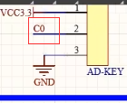

如果左下角不对应会报错的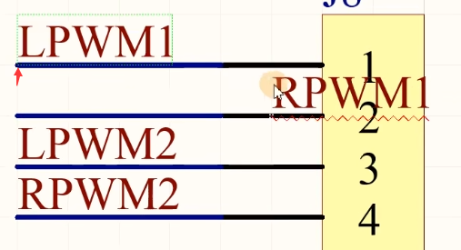

## 第13课value值的核对

- 器件位号Designator编辑（如R?）：工具→标注→原理图标注**（快捷键T A A）**，接受变更执行变更

  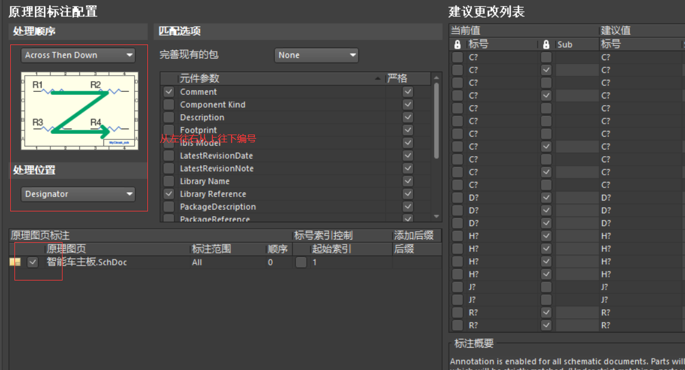

- Value值：如电阻下面写的1K，未设置则会默认为Design Item ID

## 第14课封装的统一管理

是指在电子产品中将集成电路芯片（IC）或其他电子元件安装在印制电路板（PCB）上时所采用的外部包装形式。PCB封装的主要作用是保护电子元件，并提供与外部世界的连接接口。

- 封装模型Footprint的意义：原理图怎么映射到PCB
- 封装管理器：工具→封装管理器 按住Shift再点，可以扩选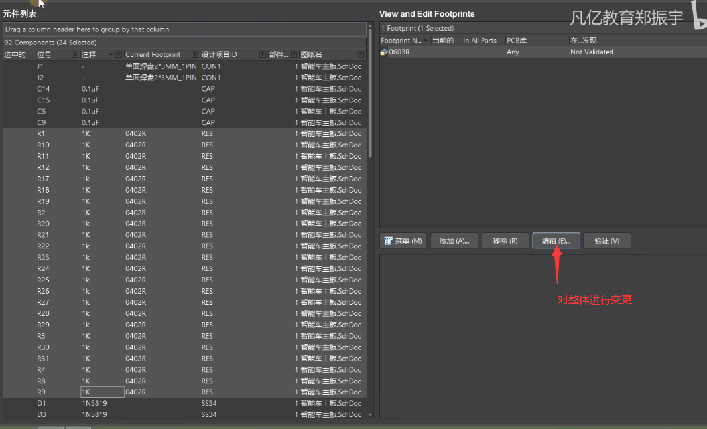
- boom表生成对应的封装（Bom表要给供应商，让他们做电子原件，然后邮到厂区开钢网，贴片）

## 第15课原理图的编译设置及检查

- 报错设置：工程→工程选项，**Error Reporting是错误表，在这设置各种错误的报告格式**

设置致命错误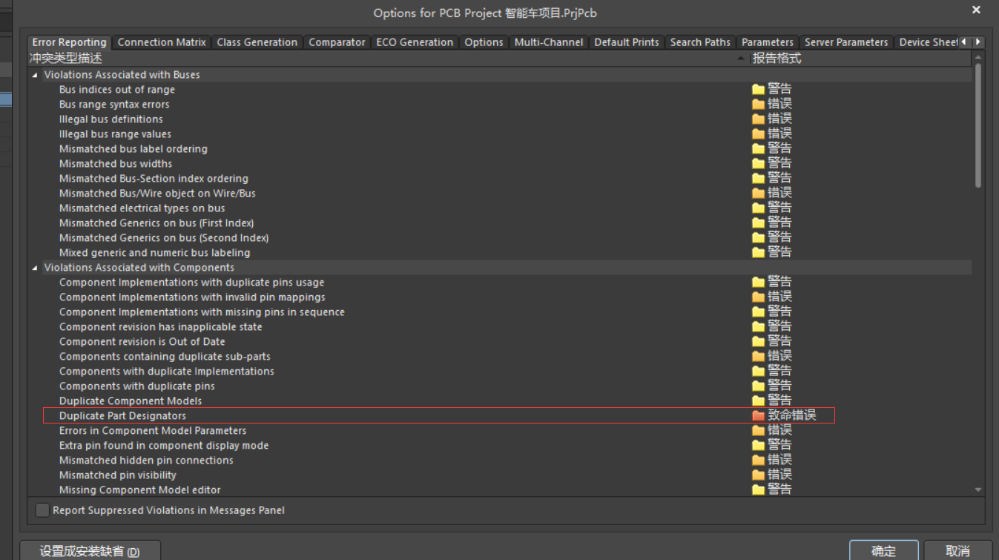

- 编译：工程→Compile PCB....（第一个）
- 根据元件库同步更新：AD中如果修改了元件库，原理图中不会自动更新，在工具→从库更新中，选择要更新的元件进行更新
- 如果是单端的要加上指示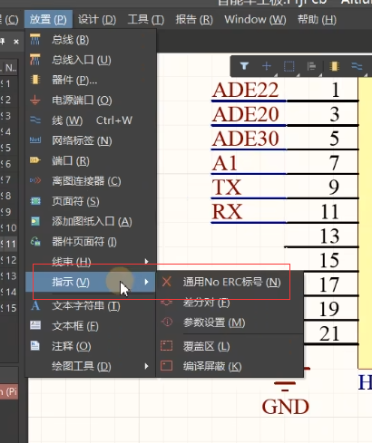

# 第三部分: PCB封装库的创建方法及现有封装调用

内容: PCB封装（和实物对应的）是我们电子设计图纸和实物之间的映射体，具有精准数据的要求。在实际设计中该如何在对应的规格书当中获取创建封装的数据参数﹖

## 第16课常见CHIP封装的创建电阻容 SOT 二极管

## 第17课常见IC类封装的创建

## 第18课利用C封装创建向导快速创建封装

## 第19课常用PCB封装的直接调用

## 第20课3D模型的创建和导入