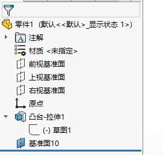
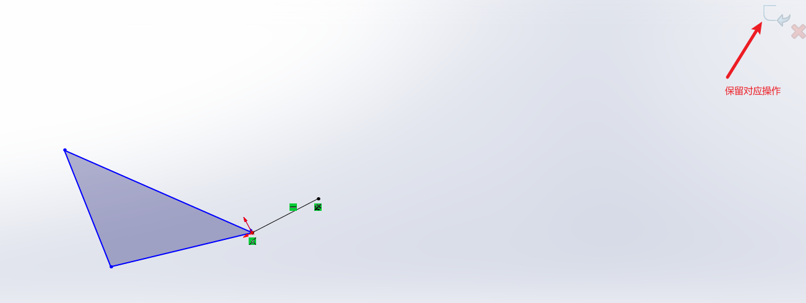

草图->零件->装配图->工程图

[SOLIDWORKS 2021 教学 精品教程 | B站点赞NO.1 - 哔哩哔哩 (bilibili.com)](https://www.bilibili.com/read/cv22252118?spm_id_from=333.999.0.0&jump_opus=1)

注意点：蓝色的草图说明没有完全定义需要修改

ctrl+n新建零件后ctrl+s直接保存

ctrl+鼠标滚轮 平面移动

ctrl+左键 多选图形

gb_part 零件文件  gb_assembly 装配体文件

草图—草图绘制—选择基准面—开始绘制草图

——————————

# 第一课 教程简介与软件界面及基础操作

## 1.1 尺寸约束

智能尺寸—选择矩形边线（或右键叫出鼠标笔势快捷操作）—移动到合适位置进行标注—输入尺寸（标注线标为黑色意味草图完全约束）—特征卡中选择拉伸凸台—左侧设计书指定深度—右上角对勾确定操作

选项—草图—在生成实体时启用荧屏上输入数字

## 1.2 约束角度

选中一根线再选中另一根线 

## 1.3 视图定向

视图定向按钮 （或者空格）

选择想要正视的面—视图正式于

左侧设计树查看操作

# 第二课 草图绘制

## 2.1 直线、矩形、圆形等图形绘制

草图—直线—起点到终点（终点可拖动）—点击直线，设计书弹出草图属性—添加删除几何关系（固定分为线固定和点固定）—选项中选择构造线（参考用点划线）或无限长度属性

包含编辑矩形、编辑圆形、编辑槽、编辑圆角的操作

# 第三课 草图几何关系与编辑

## 3.1 草图几何关系

包括：重合、中点、相切、平行、相等、共线、对称

1.选择一个基准面2.点击转换实体引用3.选择所要转换的实体4确认，你会发现转换的实体会投影在你所选的基准面上。不信你可以试试两个相互垂直的面进行转换实体，最后得到的是线。转换实体引用，开始先画的是底部的圆，拉伸是画柱体，现在画的是顶部的圆。然后，得到顶部圆的方式有2个，一个是通过圆柱体顶部的轮廓线，另一个是通过底部的圆转换。

