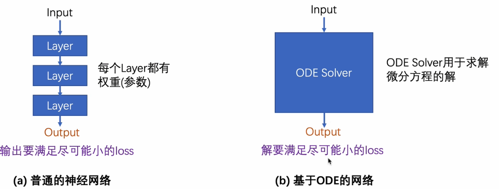
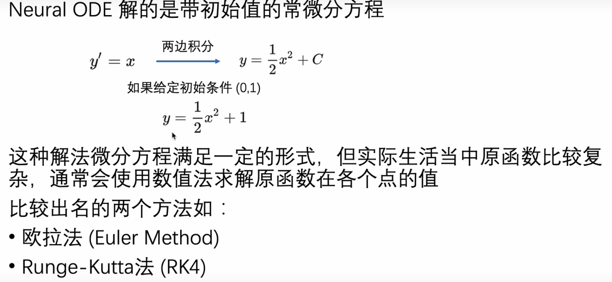
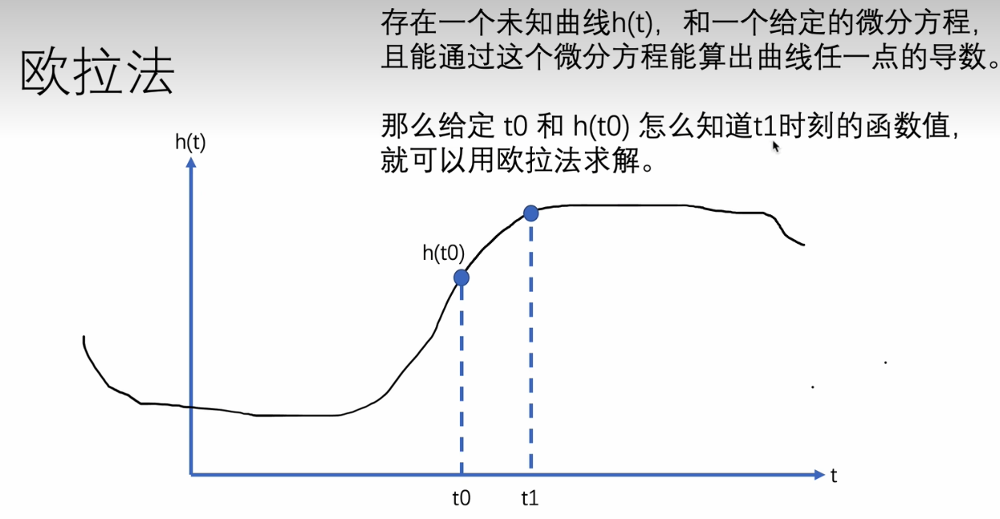
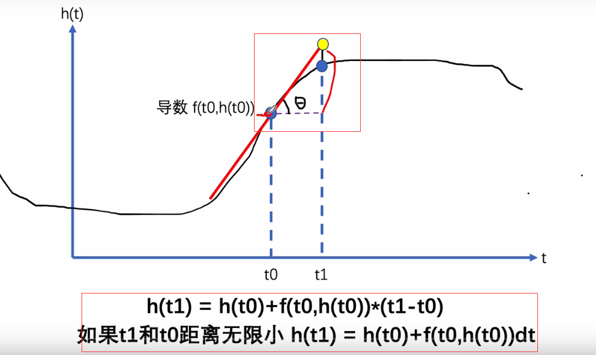
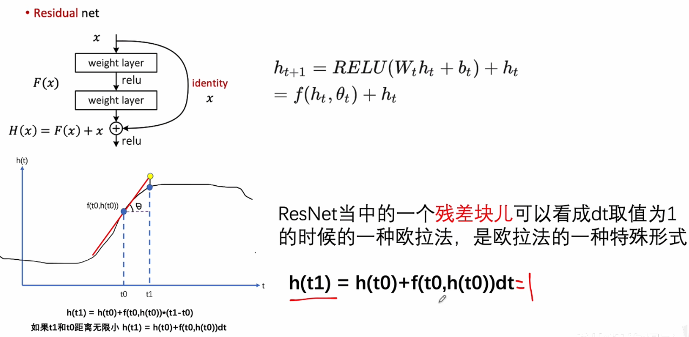
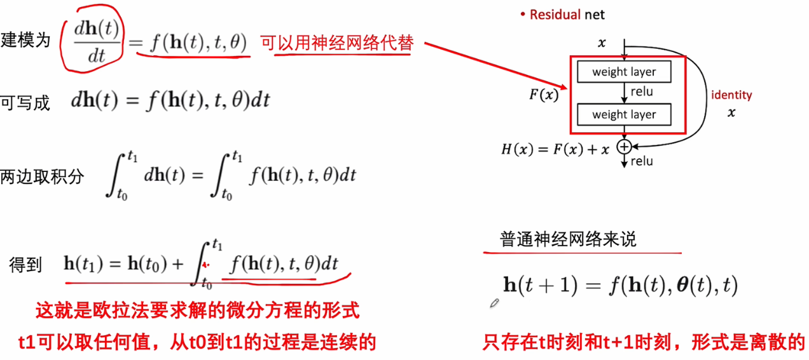
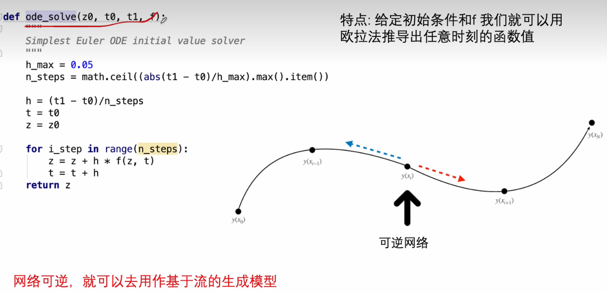
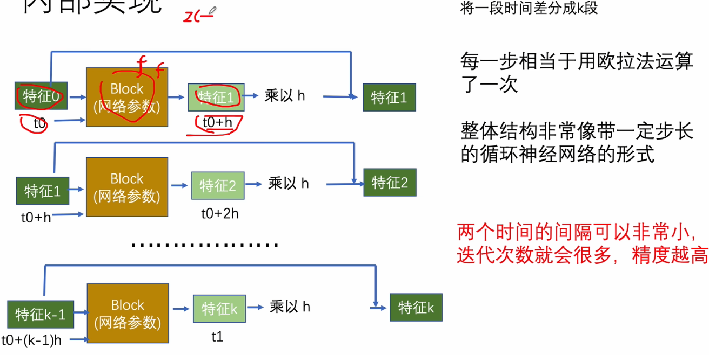
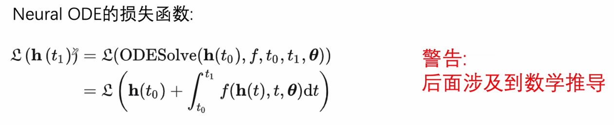
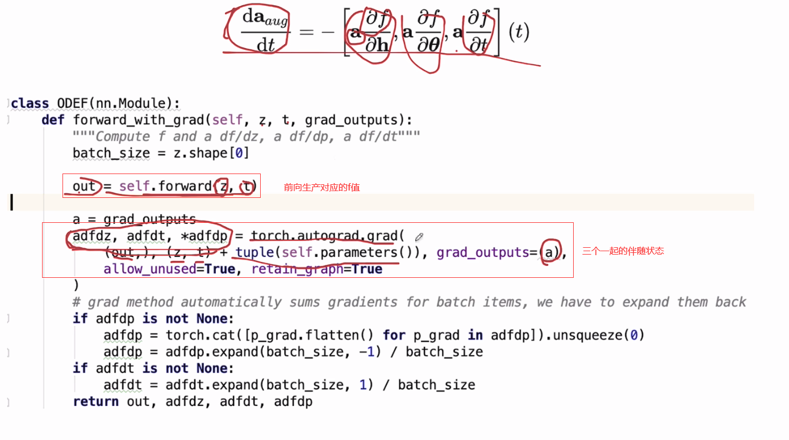

# 1.神经网络求微分方程

## 1.1 ODE

> ODE和普通神经网络的区别；尽可能小的loss来优化ODE的解

用ODE表示有什么优势

- 1.Powerful representation:微分方程可以用数值法求解，因次对于任何连续函数都有良好的逼近能力
- 2.Memory efficiency:**不需用到反向传播，因此训练上节约内存**
- 3.Simplicity:**不需要考虑复杂的调参和网络设计，形式简洁**
- 4.Abstraction:让网络不需要考虑每层需要做什么，只需要考虑怎么计算结果

## 1.2 求解过程

### 1.2.1 欧拉法求解微分方程

实际生活中原函数比较复杂；采用欧拉法进行求解（欧拉法：存在一个未知曲线h(t)）

### 1.2.2 ResNet和欧拉法的关系

**resnet的残差块是欧拉法的特殊形式**；构造基于微分方程的网络

使用神经网络替代

### 1.2.3 使用欧拉法构建Neural ODE的形式

ODE是联系的

### 1.2.4 代码实现

网络内部参数共享的：给定特征0，加上时间得到其他特征；通过时间间隔进行迭代

### 1.2.5 ODE的反向传播

反向传播需要保留所有层的激活值，导致开销比较大

伴随灵敏度法:在神经网络中，每个神经元的输出都依赖于它的输入和权重，而梯度依赖也是基于这种依赖关系进行计算的。因此，要确定梯度依赖的隐层状态z(t)，需要对神经网络的结构和参数进行分析，并使用反向传播算法计算。（不用保存中间内容就可以往后求解）

对正向函数求loss，直到z($t_N$)

几个伴随状态组合

> 代码示例

