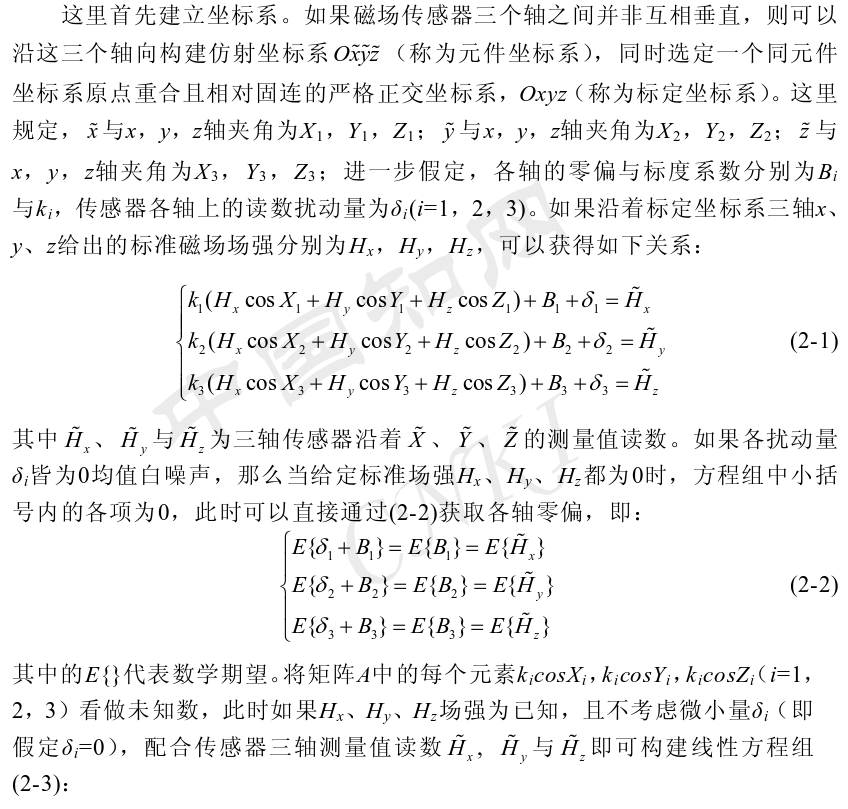
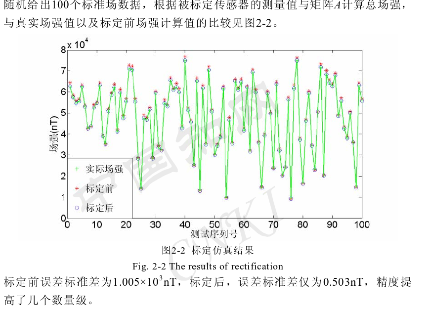

# 0. 数学

## 0.1 [最小二乘法](https://blog.csdn.net/tymatlab/article/details/78937780)

# 1.地磁导航关键技术研究 

磁倾角（Magnetic Inclination）：北半球俯角；南半球仰角；地磁场线与地表水平面之间的夹角。它用于描述地磁场线相对于地表的倾斜程度。在赤道附近，地磁场线几乎与水平面平行，磁倾角接近于零。然而，随着纬度的增加，磁倾角逐渐变大，地磁场线与水平面之间的夹角增加。

磁偏角：磁偏角（Magnetic Declination）是指地磁北极（地理上的北极）与**磁北极（指示地磁场方向的北极）之间的夹角**。它用于描述地磁北极与地理北极之间的差异。磁偏角的数值可以是正值或负值，具体取决于地点和时间。不同地区的磁偏角也会随着时间的推移而发生变化。

## 1.1 背景

优势：

1. 不易受环境影响

2. 无源导航方法；没有电磁信号泄露
3. 匹配定位算法（将接收到的信号与事先建立好的指纹库进行比对）。可以和其他源信息进行组合导航
4. 矢量场，提供丰富的参照信息

## 1.2 关键技术

地磁场非常微弱，其幅值范围在30000~70000纳特斯拉（简称纳特或nT），已受环境干扰。地磁场的梯度变化范围从每公里几纳特（地磁异常微弱区）到上百 纳特（地磁异常剧烈区）不等。要敏感如此微小的变化量无疑对传感器的分辨 率和精度提出了相当严苛的要求

1.2.1 磁场干扰来源：

1. **载体自身的钢铁结构会被地磁场磁化而产生激磁；**
2. 载体运动时通过自身导体材料的磁通会发生改变，进而产生涡流磁场；
3. 载体所携带的电器设备中的电流产生的干扰磁场。

1.2.2 磁场测量技术

1. 磁场传感器的设计与制造 
2. 磁场传感器的标定与校准：传感器的三个敏感轴不严格垂直，各轴上的灵敏 度等电器特性达不到严格对称等情况
3. 干扰磁场的排除：针对载体材料受地磁场影响 而产生的同姿态相关的干扰场，可以通过航磁补偿的方式，通过建立模型[ 61,62]， 求解参数[ 63,64]，进而反向补偿的方法来解决 [65-67]。

1.2.3 基于地磁场的定位与导航技术研究

3. 基于滤波技术的组合导航方法研究 ：将磁场测量信息和惯性导航系统的输出通过卡尔曼滤波器进行信息融合， 从而构成惯性、地磁组合导航系统也是目前非常流行的一种导航方案

## 1.3 磁测量补偿研究

要提高磁场测量的精度，一方面要提高测量所用传感器的精度，另一方面是要**克服来源于载体自身的磁场干扰。**

### 1.3.1 三轴传感器的标定 

标定完成后的换算关系：

> 实验评价方法：标定后评价方法和标定前的评价方法
>
> 

### 1.3.2 自身的干扰磁场

一类是与载体姿态无关的干扰磁场，通常来自机载电器设备，可称为电磁干扰

另外一类是与载体姿态相关的干扰磁场[ 113]，可称为航磁干扰。航磁干扰是指，当载体在地磁场中运动时， 其自身的金属材料会受到地磁场的影响，因被部分磁化而产生激磁磁场以及因磁通变化产生涡流磁场等干扰场的总和。（Leliak提出了对应的解决方案）

## 参考文献

地磁相关：

地磁模型与地磁导航

Geophysical navigation technologies  and applications

Jiang Lingling, Li Xinran. Path Planning during the Geomagnetic Navigation.  Progress in Electromagnetics Research Symposium, Hangzhou, China, 2008: 65~67. 

61. 张琦, 潘孟春, 陈棣湘, 吴美平. 从潜艇磁测数据中分离地磁场的研究. 探测与控制学报. 2008, 30（增刊）: 1~4. 
62. P. Pin-anong. The Electromagnetic Field Effects Analysis which Interfere to 
Environment near the Overhead Transmission Lines and Case Study of Effects  Reduction. M. Eng. Thesis, King Mongkut’s Institute of Technology  Ladkrabang, Bangkok, Thailand, 2002: 21~37. 

63. A. V. Kildishev, J. A. Nyenhuis. External Magnetic Characterization of Marine 
vehicles. OCEANS 2000 MTS/IEEE Conference and Exhibition, 2000: 
1145~1147. 
64. Pinheiro J C A. Vectorial magnetic field of a vessel from the vertical 
field[J].OCEANS '94. 'Oceans Engineering for Today's Technology and  Tomorrow's Preservation.'Proceedings, 1994,3:519~521. 
65. M. Weiner. Electromagnetic Analysis Using Transmission Line Variables. 
World Scientific Publishing, 2001: 75~103. 
66. G. Ioannidis. Identification of a Ship or Submarine from its Magnetic Signature. 
IEEE. Transactions on Aerospace and Electronic Systems. 1997, (3): 327-329.  67. 张琦, 潘孟春, 吴美平. 地磁辅助导航中的潜艇干扰磁场. 中国关系技术学
报. 2009, 17(3): 293~296. 61. 张琦, 潘孟春, 陈棣湘, 吴美平. 从潜艇磁测数据中分离地磁场的研究. 探
测与控制学报. 2008, 30（增刊）: 1~4. 
62. P. Pin-anong. The Electromagnetic Field Effects Analysis which Interfere to 
Environment near the Overhead Transmission Lines and Case Study of Effects  Reduction. M. Eng. Thesis, King Mongkut’s Institute of Technology  Ladkrabang, Bangkok, Thailand, 2002: 21~37. 

# 2.基于MARG传感器的微型航姿系统研究与实现

## 4.3 三轴磁传感器的标定

磁传感器的标定过程会更加复杂，不仅要将各敏感轴本身 的制造误差与安装误差去除，还要消除使用过程中载体环境产生的磁干扰，才能 获得准确的航向角信息

### 4.3.1 基于误差分离法的初始标定

整个初始标定环境（系统模块及无磁转台） 不存在软磁干扰，可将磁传感器输出数学模型 [27-28]表达如下

基于此，地磁场在 载体坐标系下分量的表达式如下：

### 4.3.2 基于误差分离的椭球拟合现场标定

硬磁干扰，则在环境温度等条件一样的情况下，会在各磁敏感轴上产生一个固定的磁场分量，相当于改变了磁传感器原有偏置量的大小$b^m$,**如何有效的现场标定方法消除载体环境磁干扰？**

灵敏度因子误差以及非正交角的存在，使三轴磁传感器感知的地磁场数据在 空间中的拟合由球面畸变成了椭球，而零偏的存在，使其球心偏离原点。

## 参考文献

**[24] Chu Z, Lin X, Gao K, et al. Error-separation method for the calibration of magnetic compass[J]. Sensors & Actuators A Physical, 2016, 250:195-201**

**[27] 高可，林新华，储志伟，等.无磁转台的电子罗盘误差分离标定方法[J].传感器与微 系统, 2017, 36(2):21-24.** （传感器标定方法）

[28] Chu Z, Chen C, Liu Y, et al. Magnetic orientation system based on magnetometer, accelerometer and gyroscope[J]. CAAI Transactions on Intelligence Technology, 2017, 2(4):298-307.

 [29] Fang J, Sun H, Cao,J et al. A novel calibration method of magnetic compass based on ellipsoid fitting[J]. IEEE Transactions on Instrumentation & Measurement, 2011, 60(6):2053-2061.

[30] 李勇，刘文怡，李杰，等.基于椭球拟合的三轴磁传感器误差补偿方法[J].传感技术 学报，2012, 25(7):917-920.