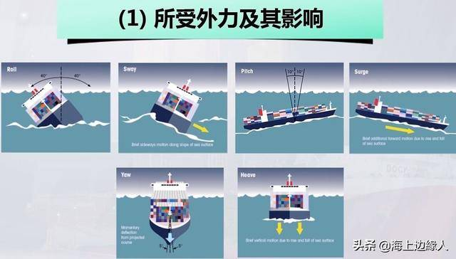
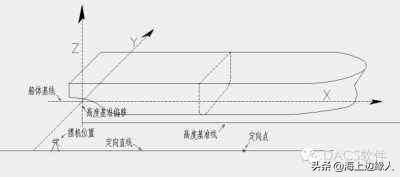

您好，这是必应。我为您介绍以下五篇有关频谱分析在船体升沉运动测量的研究，并概括一下研究内容：

- 基于IMU与UKF的船舶升沉运动信息测量方法¹：根据船舶升沉运动模型和频谱分析方法，建立描述惯性测量单元（IMU）的加速度测量信息与船舶升沉运动状态量关系的解析模型，基于无迹卡尔曼滤波（UKF）算法非线性滤波的特点，进行升沉运动滤波解算，通过仿真分析和三自由度平台升沉运动测量实验验证，结果表明该方法具有更快的收敛速度和更高的测量精度。
- 基于NARX神经网络的船舶升沉运动实时预测方法²：基于带外源输入的非线性自回归（NARX）神经网络建立单海况预测模型，利用船舶系统仿真器获取母船升沉运动仿真数据，将NARX模型与卡尔曼（Kalman）模型、普通反向传播（BP）神经网络模型进行对比分析，结果表明NARX模型具有较高的预测精度和较好的鲁棒性。
- 船用起重机主动升沉补偿控制系统研究³：介绍了一种具有主动升沉补偿功能的船用起重设备，其由母船升沉运动检测系统、控制系统、液压驱动系统和机械执行机构组成，采用基于神经网络和模糊逻辑的自适应控制算法，通过对船体运动进行预测和补偿，提高了起重母船深海作业的安全性和高效性。
- 基于IMU与UKF的船舶升沉运动信息测量方法⁴：根据船舶升沉运动模型和频谱分析方法，建立描述惯性测量单元（IMU）的加速度测量信息与船舶升沉运动状态量关系的解析模型，基于无迹卡尔曼滤波（UKF）算法非线性滤波的特点，进行升沉运动滤波解算，通过仿真分析证明了所提方法在船舶升沉运动测量中的有效性。利用三自由度平台升沉运动测量实验验证，结果表明，同一模型下，相比于扩展卡尔曼滤波（EKF）算法的解算结果，所提方法具有更快的收敛速度和更高的测量精度；对船舶升沉位移的估计精度达到最大升沉幅值的5%，可以得到精确、无时延的船舶升沉运动信息。
- 船舶运动再现与实时模拟系统研究：设计并实现了一种能够再现并实时模拟不同海况下不同类型母船及其装备在水面上或水下作业时所受到各种环境因素影响而产生的六自由度运动状态变化情况的系统。利用快速傅里叶变换（FFT）算法在线分析升沉位移信号频谱组成，并利用卡尔曼滤波算法构造观测器，在短时间内实时估计船舶设备的升沉位移，及时精确对船舶装备的升沉运动进行控制。

希望这些信息对您有帮助。😊

源: 与必应的对话， 2023/5/20
(1) 船舶运动再现与实时模拟系统研究--《吉林大学》2019年硕士论文. https://bing.com/search?q=%e9%a2%91%e8%b0%b1%e5%88%86%e6%9e%90+%e8%88%b9%e4%bd%93%e5%8d%87%e6%b2%89%e8%bf%90%e5%8a%a8%e6%b5%8b%e9%87%8f.
(2) 基于IMU与UKF的船舶升沉运动信息测量方法. https://bhxb.buaa.edu.cn/bhzk/cn/article/doi/10.13700/j.bh.1001-5965.2020.0223.
(3) 基于IMU与UKF的船舶升沉运动信息测量方法 - 知网空间. https://www.cnki.com.cn/Article/CJFDTOTAL-BJHK202107002.htm.
(4) 船舶运动再现与实时模拟系统研究--《吉林大学》2019年硕士论文. https://cdmd.cnki.com.cn/Article/CDMD-10183-1019159362.htm.

您好，这是必应。我找到了一些关于使用零速检测进行船体升沉运动测量的研究，您可以参考一下：

- 基于IMU与UKF的船舶升沉运动信息测量方法¹：根据船舶升沉运动模型和频谱分析方法，建立描述惯性测量单元（IMU）的加速度测量信息与船舶升沉运动状态量关系的解析模型，基于无迹卡尔曼滤波（UKF）算法非线性滤波的特点，进行升沉运动滤波解算，通过仿真分析和三自由度平台升沉运动测量实验验证，结果表明该方法具有更快的收敛速度和更高的测量精度。
- 基于NARX神经网络的船舶升沉运动实时预测方法²：基于带外源输入的非线性自回归（NARX）神经网络建立单海况预测模型，利用船舶系统仿真器获取母船升沉运动仿真数据，将NARX模型与卡尔曼（Kalman）模型、普通反向传播（BP）神经网络模型进行对比分析，结果表明NARX模型具有较高的预测精度和较好的鲁棒性。

希望这些信息对您有帮助。😊

源: 与必应的对话， 2023/5/20
(1) 基于IMU与UKF的船舶升沉运动信息测量方法. https://bhxb.buaa.edu.cn/bhzk/cn/article/doi/10.13700/j.bh.1001-5965.2020.0223.
(2) 基于IMU与UKF的船舶升沉运动信息测量方法. https://bhxb.buaa.edu.cn/bhzk/cn/article/Y2021/I7/1323.
(3) 基于NARX神经网络的船舶升沉运动实时预测方法. http://www.ship-research.com/cn/article/doi/10.19693/j.issn.1673-3185.01717.

您好，这是必应。我找到了一些关于使用零速检测进行船体升沉运动补偿的研究，您可以参考一下：

- 基于补偿技术的起重机深水波浪补偿系统研发¹：介绍了上海振华重工自主研发的一种能用于深水环境下的带主动波浪升沉补偿系统的新型起重机，其原理是利用液压缸配合蓄能器的波浪升沉补偿试验台，采用博世力士乐的二次液压控制方案，运用时滞参数辨识原理识别系统的时滞参数，采用相关的智能控制算法实现主动升沉补偿。
- 基于模糊PID的拖网渔船升沉补偿系统研究²：设计了一种基于模糊PID控制器的液压缸式升沉补偿器自动调节装置，通过对阀控非对称缸位置控制系统建立数学模型，利用高性能数字控制器进行前馈控制，实现扰动前馈控制电压，通过仿真分析表明该系统具有较低的位置跟踪误差和较好的抗干扰能力。
- 船用起重机主动升沉补偿控制系统研究³：介绍了一种具有主动升沉补偿功能的船用起重设备，其由母船升沉运动检测系统、控制系统、液压驱动系统和机械执行机构组成，采用基于神经网络和模糊逻辑的自适应控制算法，通过对船体运动进行预测和补偿，提高了起重母船深海作业的安全性和高效性。

希望这些信息对您有帮助。😊

源: 与必应的对话， 2023/5/20
(1) 基于补偿技术的起重机深水波浪补偿系统研发 - 知乎. https://zhuanlan.zhihu.com/p/311121186.
(2) 中国水产期刊网. http://www.aquaticjournal.com/article/doi/10.3969/j.issn.1007-9580.2022.01.014.
(3) 船用起重机主动升沉补偿控制系统研究 - 百度学术. https://xueshu.baidu.com/usercenter/paper/show?paperid=22a071cda6388014f5fe0fc7c72b2dfe.

## 1. 船体运动

一般都会有六个运动状态，分别为：ROLL 横摇、SWAY横荡、PITCH纵摇、SURGE纵荡、YAW首摇、HEAVE垂荡。

我们可以取以船舶重心为原点的直角坐标系，X轴平行于船体基线指向船首，Z轴垂直于船体基线向上，Y轴指向船体左侧（实际的地理坐标系为东北天），则横摇、纵摇、首摇分别是绕X、Y、Z轴的往复转动，纵荡、横荡、垂荡分别是沿X，Y，Z轴的往复平动。其中，纵摇、纵荡和垂荡称为纵向运动，横摇、横荡和艏摇称为横向运动。

1. ROLL横摇：横摇最简单理解，大家做船，船舶左右摇晃，一般都是横摇现象。横摇也是威胁船舶安全的最主要因素。船舶在海上最容易发生横摇且摇摆幅度最大，对船舶的使用和安全、船员生活与工作有严重影响。
2. SWAY横荡：横荡是指浸于水中的物体沿最长延展方向的垂直方向的水平线性振荡运动。
3. PITCH纵摇：纵摇是船体绕横轴的回转振荡运动。船舶因纵摇运动而遭致的不利后果有：同等功率下的失速、严重的结构损伤、船员晕船症。
4. SURGE纵荡：纵荡是指浸于水中的物体沿最长延展方向的水平线性振荡运动。
5. YAW首摇：首摇是指浸于水中的物体绕船体垂直轴的旋转振荡运动。通常，可以把这种船舶的艏摇运动视为除了操舵不良外，还由下列三个因素引起的结果：船体上的静压力不平衡、海浪中水的轨圆运动、陀螺作用。
6. HEAVE垂荡：浸于水中的物体沿垂直方向的线性振荡运动称为“垂荡”。

## 2. 升沉运动

- 升沉运动主要由海浪引起，要想研究升沉运动 需要明确海浪的特点。

解算误差来源

- 升沉信息发散的原因，为后 文抑制发散提供前提条件，导致发散的原因有纯惯性高度通道的不稳定性，以 及加速度零偏、舒拉振荡、地球振荡、傅科振荡等低频干扰。

- 升沉信息是捷联惯导系统安装位置处的升沉信息，而往往捷联惯导系统的安 装位置和舰船重心是不重合的，通常需要得到的是舰船重心处的升沉信息，当 舰船存在横摇或纵摇运动时，二者是不相同的，捷联惯导系统安装位置和舰船 重心的不重合会导致**杆臂效应误差**

