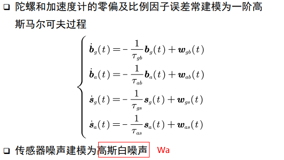

这篇文章提出“**三步法**”，一篇文献的阅读可以分成三次，逐次深入，从**大致了解**、到**掌握内容但不包括细节**、最后是**深入理解**。不重要的文献停留在第一次或第二次就好。

第一遍：标题、摘要、结论。可以看一看方法和实验部分重要的图和表。这样可以花费十几分钟时间了解到论文是否适合你的研究方向。

第二遍：**是通读，不看证明，认真看图表，并且能用自己的话说出内容。**不需要知道所有的细节，需要了解重要的图和表，知道每一个部分在干什么，圈出相关文献。觉得文章太难，可以读引用的文献。

第三遍：提出什么问题，用什么方法来解决这个问题。实验是怎么做的。合上文章，回忆每一个部分在讲什么。

**带着问题去阅读**是保证思维活跃的方法，做完第一次阅读，你需要回答出以下五个问题：1、研究背景意义2、研究创新点3、研究方法4、结论与讨论

# 1.论文阅读

## 1.1第一遍阅读

用时：5-10分钟（个人觉得如果是英文，这个时间可能延长到15分钟）。**带着问题去阅读**是保证思维活跃的方法，做完第一次阅读，你需要回答出以下五个问题：

1.**类型**：这是一篇什么类型的文章？测量数据类/现有系统的分析/描述一个研究原型/...

2.**内容**：它和其他什么文章相关？用了哪些理论基础来分析问题？

3.**正确性**：它的假设是合理、有价值的吗？

4.**贡献**：它的主要贡献是什么？

5.**清晰度**：这篇文章表述的好吗，是否清楚？

> 第一遍**只需要浏览以下内容**：
>
> 1.标题、摘要和引言（即第一章）。
>
> 2.各级标题
>
> 3.结论
>
> 4.扫一遍参考文献，标注你已经读过的。

## 1.2第二遍阅读

用时：不超过1小时。读完这一遍，要能理解文章的内容，能总结文章的主旨和依据并转述给其他人听。

这一遍是通读全文，但忽略证明之类的细节。读的时候可以记下关键点、进行批注（我会用高亮进行标注）。

1.特别关注**图、表和其他可视化信息**。带着这些问题：坐标轴标示是合理的吗？是不是因为坐标轴刻度的不合理，才让结果看起来很显著？这样的问题可以区分粗制滥造的工作与真正优秀的工作。

2.标注出**没读过的参考文献**，方便之后进一步阅读。

对于感兴趣、但没有完全在你研究点以内的文章，第二遍阅读已经足够了。**有时候读完还是没办法理解一篇文章**，可能是因为：这个方向的问题你比较陌生，不了解术语和缩写词汇；也可能是作者用了一个你不了解的证明/实验方法；也可能这篇文章写的就是很差，用了没有确凿证据的说法和很多的引用；也可能就是你读累了...

这时候，可以选择：(a)放弃这篇文献，并祈祷未来的研究中你不需要了解这篇文献；(b)先放着，等会儿再看，可以去补充一点背景资料；(c)就这样，进入第三遍阅读。

## 1.3第三遍阅读

用时：新手可能需要4-5小时，经验丰富的科研人员可能只要1小时。这一遍结束，你应该能凭记忆说出这篇文章的**结构**，明确它的**长短处**，特别是能精确指出其中**隐含的假设、参考文献的遗漏、实验或分析技术的潜在问题**。

这一遍的方法就是“**重新实现**”。根据文章的假设和方法重新实现其中的工作，坚信只要作者能做出来，你也能做出来。没有什么比跟着做一遍更能理解文章了。

这一步需要特别关注细节。

# 2.做文献综述

做文献综述的方法。这时候你可能要读几十篇并不熟悉领域的论文，**应该怎么找到要读的论文呢**？

1.准备好一些**最凝练的关键词**和**搜索引擎**（谷歌学术/CiteSeer/...），搜索3-5篇相关文献。

每篇都做第一遍阅读，然后读“related work”这一章节，可以得到近来工作的缩略总结，甚至直接找到一篇综述文章（那就可以直接跳到2了）。

2.在这几篇的引用文献里，找**相同的文章和作者**。这些就是这个领域的重要文献和研究者，把这些文章下载好，放在一边；同时去作者的网站找他们最近发表的论文，可以让你知道这个领域的**顶级会议**，因为最好的研究者通常在最好的会议发论文。

3.去顶级会议的官网，快速浏览最近的**会议记录**，找到**和你方向相关的论文**，下载下来，加上**第二步下载的文献**，这些就是你**调研的第一批资料**。这些文章都要做到**第二遍阅读**。如果过程中发现它们都引用了某篇之前没发现的文献，去下载阅读，逐步迭代。

> 3.案例：
>
> 0.abstract
>
> 
>
> 1.title
>
> 
>
> 2.abstract
>
> 
>
> 3.introduction
>
> 
>
> 4.method
>
> 
>
> 5.experiments
>
> 
>
> 6.conclusion

# 3.案例1：基于MARG传感器的微型航姿系统研究与实现

0.abstract

背景，MARG传感器，标定方法和信息融合两个方面的算法做了重点研究；包含静态动态测试；对磁标定的研究

几种算法

1.title

2.abstract

3.introduction

1. 加速度计：1024LSb/g表示每1024个数字信号的变化代表1g的加速度变化。

2. 电平

3. STM32F4是一种基于ARM Cortex-M处理器核心的MCU（集成了处理器核心、存储器、输入/输出接口和各种外围设备控制器等多种功能模块的单芯片微型计算机系统），由STMicroelectronics公司生产。它是STM32系列中的一员，采用了高性能的Cortex-M4处理器核心，集成了多种外设和接口

4.method

5.experiments

6.conclusion

避免三角函数的复杂运算+90度的极点问题+具有连续性

文献2，文献5：数字电子罗盘的介绍，文献23：四阶龙格一库塔法,    文献24磁传感器；六位置标定法

文献12白噪声：Valenti R G, Dryanovski I, Xiao J. A linear Kalman filter for MARG orientation estimation using the algebraic quaternion algorithm[J]. IEEE Transactionson Instrumentation &
Measurement, 2016, 65(2):467-481

文献37，从理论与大量实际测试数据中找到最佳的卡尔曼滤波参数[37]

# 3.案例2：深度惯性四旋翼动力测程仪DIDO: Deep Inertial Quadrotor Dynamical Odometry

0.abstract

1.title

2.abstract

3.introduction

1. 雷达(LiDAR可以在任何光照条件下工作，但它容易受到雨、雪、雾、灰尘等环境因素的影响，导致其精度下降或无法正常工作)和相机无法达到有效识别的场景需要imu推导

2. 论文[`1-9]展现了神经网络的性能;但是作为一个4自由度欠驱动系统，四旋翼的速度和倾斜度之间存在运动状态的耦合，这在一般的状态估计系统中没有得到充分利用。
3. 在旋转阶段，通过重力对准将去偏的角速度和加速度融合，以获得精确的旋转。在平移阶段，将修改后的动力学视为过程模型，将网络中的加速度、速度和位置视为观测模型，以准确估计运动学、动力学状态和外部参数。这封信的贡献列举如下：

4.method

5.experiments

[1]视觉导航系统

# 4. 惯导公式

## 4.1 误差标定

### 4.1.1 零偏

加速度计的零偏在这里表示为
$$
b_{a}=\left[\begin{array}{lll} b_{a x} & b_{a y} & b_{a z} \end{array}\right] \\
$$
陀螺仪的零偏在这里表示为
$$
b_{g}=\left[\begin{array}{lll} b_{g x} & b_{g y} & b_{g z} \end{array}\right]\\
$$

### 4.1.2 标度因数误差

加速度计的标度因数这里表示如下：
$$
K_{a}=\left[\begin{array}{ccc} K_{a x} & & \\ & K_{a y} & \\ & & K_{a z} \end{array}\right]
$$
陀螺仪的标度因数这里表示为：
$$
K_{g}=\left[\begin{array}{ccc} K_{g x} & & \\ & K_{g y} & \\ & & K_{g z} \end{array}\right]\\
$$

### 4.1.3 安装误差

陀螺仪误差：b坐标系是正交的imu坐标系，g坐标系的三个轴是分别对应三个陀螺仪。

$$
S_{g}=\left[\begin{array}{ccc} 0 & S_{g x y} & S_{g x z} \\ S_{g y x} & 0 & S_{g y z} \\ S_{g z x} & S_{g z y} & 0 \end{array}\right]\\
$$
加速度计的安装误差原理和它一样，直接给出公式。
$$
S_{a}=\left[\begin{array}{ccc} 0 & S_{a x y} & S_{a x z} \\ S_{a y x} & 0 & S_{a y z} \\ S_{a z x} & S_{a z y} & 0 \end{array}\right]\\
$$
这样一共有12项安装误差参数

### 4.1.4 零偏等标定方法总结

标定就是可以随意更改ax、ay和az，怎么解其他的参数。

$$
\left[\begin{array}{c} A_{x} \\ A_{y} \\ A_{z} \end{array}\right]=\left[\begin{array}{ccc} K_{a x} & S_{a x y} & S_{a x z} \\ S_{a y x} & K_{a y} & S_{a y z} \\ S_{a z x} & S_{a z y} & K_{a z} \end{array}\right]\left[\begin{array}{l} a_{x} \\ a_{y} \\ a_{z} \end{array}\right]+\left[\begin{array}{l} b_{a x} \\ b_{a y} \\ b_{g z} \end{array}\right]\\
$$

1. 解算时用的是东北天坐标系，板子是别的坐标系，加负号是为了和我的坐标系对应上

2. 初始的误差（陀螺误差模型）：零偏，有个固定的还有一个随机的每次开机都不一样（固定的可以通过标定补偿，**随机的每次开机的时候值都不一样，前3秒取个平均扣除掉**）

   

## 4.2 旋转定义

### 4.2.1 旋转矩阵

假设旋转前，载体系(b系)的单位正交基为 $\left(\mathbf{e}_{1}, \mathbf{e}_{2}, \mathbf{e}_{3}\right) ，旋转后对应的单位正交基为 \left(\mathbf{e}_{1}^{\prime}, \mathbf{e}_{2}^{\prime}, \mathbf{e}_{3}^{\prime}\right)$ ，在世界坐标系(w系，不随载体的旋转而旋转)下有向量$ \mathbf{a} $，它在旋转前后两个坐标系中的坐标分别为 $\left[a_{1}, a_{2}, a_{3}\right]^{\mathrm{T}} 和 \left[a_{1}^{\prime}, a_{2}^{\prime}, a_{3}^{\prime}\right]^{\mathrm{T}}$ ，那么有
$$
\boldsymbol{a}=\left[\begin{array}{l} a_{1} \\ a_{2} \\ a_{3} \end{array}\right]=\left[\begin{array}{lll} \mathbf{e}_{1}^{T} \mathbf{e}_{1}^{\prime} & \mathbf{e}_{1}^{T} \mathbf{e}_{2}^{\prime} & \mathbf{e}_{1}^{T} \mathbf{e}_{3}^{\prime} \\ \mathbf{e}_{2}^{T} \mathbf{e}_{1}^{\prime} & \mathbf{e}_{2}^{T} \mathbf{e}_{2}^{\prime} & \mathbf{e}_{2}^{T} \mathbf{e}_{3}^{\prime} \\ \mathbf{e}_{3}^{T} \mathbf{e}_{1}^{\prime} & \mathbf{e}_{3}^{T} \mathbf{e}_{2}^{\prime} & \mathbf{e}_{3}^{T} \mathbf{e}_{3}^{\prime} \end{array}\right]\left[\begin{array}{l} a_{1}^{\prime} \\ a_{2}^{\prime} \\ a_{3}^{\prime} \end{array}\right] \stackrel{\text { def }}{=} \boldsymbol{R a}^{\prime}\\
$$
其中$ \mathbf{R}$ 就是旋转矩阵，带上坐标系下标，可以写为$\mathbf{R}^w_{b}$

> 基变换矩阵：**从i系到b系的过渡矩阵(或称从i系到b系的坐标系/基变换矩阵)**[组合导航原理(书) - 幕布 (mubu.com)](https://mubu.com/app/edit/home/9kXtUhmwA)

### 4.2.2 四元数

四元数乘法定义为
$$
\boldsymbol{p} \otimes \boldsymbol{q}=\left[\begin{array}{c} p_{w} q_{w}-\boldsymbol{p}_{v}^{\mathrm{T}} \boldsymbol{q}_{v} \\ p_{w} \boldsymbol{q}_{v}+q_{w} \boldsymbol{p}_{v}+\boldsymbol{p}_{v} \times \boldsymbol{q}_{v} \end{array}\right]\\
$$
如果你把上面的式子展开，会发现四元数乘法可以表示成矩阵与向量相乘的形式
$$
\boldsymbol{p} \otimes \boldsymbol{q}=[\boldsymbol{p}]_{L} \boldsymbol{q}\\
$$
其中
$$
\begin{aligned} [\boldsymbol{p}]_{}[\boldsymbol{p}]_{L} &=\left[\begin{array}{cccc} p_{w} & -p_{x} & -p_{y} & -p_{z} \\ p_{x} & p_{w} & -p_{z} & p_{y} \\ p_{y} & p_{z} & p_{w} & -p_{x} \\ p_{z} & -p_{y} & p_{x} & p_{w} \end{array}\right] \\ &=p_{w} \boldsymbol{I}+\left[\begin{array}{cc} 0 & -\boldsymbol{p}_{v}^{\mathrm{T}} \\ \boldsymbol{p}_{v} & {\left[\boldsymbol{p}_{v}\right]_{\times}} \end{array}\right] \end{aligned}\\
$$
其中$$ [\cdot]_{\times}$$表示向量的反对称矩阵(不了解这个概念的麻烦自行去查一下)

### 4.2.3 等效旋转矢量

可以用向量$\boldsymbol{\phi}$，并用 单位向量$\boldsymbol{u}$表示它的朝向，$\phi$ 表示它的大小，因此有

$\boldsymbol{\phi} = \phi \boldsymbol{u}\\$

等效旋转矢量的指数形式，是推导中重要的推导过程，因此先在这里给出
$$
\exp \left(\boldsymbol{\phi}^{\wedge}\right)=\exp \left(\phi \boldsymbol{u}^{\wedge}\right)=\sum_{n=0}^{\infty} \frac{1}{n !}\left(\phi \boldsymbol{u}^{\wedge}\right)^{n}\\
$$
由于带着无穷项，因此需要化简才能用。由于反对称矩阵具有如下性质
$$
\left(\boldsymbol{\phi}^{\wedge}\right)^{i}=\left\{\begin{array}{ll} (-1)^{(i-1) / 2} \phi^{i-1}\left(\boldsymbol{\phi}^{\wedge}\right) & i=1,3,5, \cdots \\ (-1)^{(i-2) / 2} \phi^{i-2}\left(\boldsymbol{\phi}^{\wedge}\right)^{2} & i=2,4,6, \cdots \end{array}\right.\\
$$
因此，指数形式可以化简为
$$
\begin{aligned} \exp \left(\boldsymbol{\phi}^{\wedge}\right) &=I+\phi\left(\boldsymbol{u}^{\wedge}\right)+\frac{1}{2 !} \phi^{2}\left(\boldsymbol{u}^{\wedge}\right)^{2}+\frac{1}{3 !} \phi^{3}\left(\boldsymbol{u}^{\wedge}\right)^{3}+\frac{1}{4 !} \phi^{4}\left(\boldsymbol{u}^{\wedge}\right)^{4}+\cdots \\ &=I+\phi\left(\boldsymbol{u}^{\wedge}\right)+\frac{1}{2 !} \phi^{2}\left(\boldsymbol{u}^{\wedge}\right)^{2}-\frac{1}{3 !} \phi^{3}\left(\boldsymbol{u}^{\wedge}\right)-\frac{1}{4 !} \phi^{4}\left(\boldsymbol{u}^{\wedge}\right)^{2}+\cdots \\ &=I+\left(\boldsymbol{u}^{\wedge}\right)^{2}+\underbrace{\left(\phi-\frac{1}{3 !} \phi^{3}+\frac{1}{5 !} \phi^{5}-\cdots\right)}_{\sin \phi}\left(\boldsymbol{u}^{\wedge}\right)-\underbrace{\left(1-\frac{1}{2 !} \phi^{2}+\frac{1}{4 !} \phi^{4}-\cdots\right)}_{\cos \phi}\left(\boldsymbol{u}^{\wedge}\right)^{2} \\ &=I+\sin \phi\left(\boldsymbol{u}^{\wedge}\right)+(1-\cos \phi)\left(\boldsymbol{u}^{\wedge}\right)^{2} \\ &=I+\frac{\sin \phi}{\phi}\left(\boldsymbol{\phi}^{\wedge}\right)+\frac{(1-\cos \phi)}{\phi^{2}}\left(\boldsymbol{\phi}^{\wedge}\right)^{2} \end{aligned}\\
$$

### **4.2.4 各种表示方式之间的转换**

既然各种方式之间是等价的，且实际使用中，各种形式都有可能出现，那么理清它们之间的转换关系就是必要的。不过由于很多推到过程过于复杂且无聊，这里就只能给出结论，对过程感兴趣的自己去查资料吧。

**1）欧拉角与旋转矩阵**

按照机器人前(x)-左(y)-上(z)的坐标系定义，并令横滚角为$ \mathbf{\alpha}$ 、俯仰角为 $\mathbf{\beta} $、航向角为 $\mathbf{\gamma}$ ，假设旋转矩阵是按照z-y-x的顺序旋转得来，那么旋转矩阵可以表示为

$\boldsymbol{R}_{w b}=\left(\boldsymbol{R}_{x}(\alpha) \boldsymbol{R}_{y}(-\beta) \boldsymbol{R}_{z}(\gamma)\right)^{T}\\$

其中
$$
\boldsymbol{R}_{x}(\alpha)=\left[\begin{array}{ccc} 1 & 0 & 0 \\ 0 & \cos (\alpha) & \sin (\alpha) \\ 0 & -\sin (\alpha) & \cos (\alpha) \end{array}\right] \\

\boldsymbol{R}_{y}(-\beta)=\left[\begin{array}{ccc} \cos (\beta) & 0 & \sin (\beta) \\ 0 & 1 & 0 \\ -\sin (\beta) & 0 & \cos (\beta) \end{array}\right] \\

\quad \boldsymbol{R}_{z}(\gamma)=\left[\begin{array}{ccc} \cos (\gamma) & \sin (\gamma) & 0 \\ -\sin (\gamma) & \cos (\gamma) & 0 \\ 0 & 0 & 1 \end{array}\right]\\
$$
也可以直接写出结果形式
$$
\boldsymbol{R}_{w b}=\left[\begin{array}{ccc} c \beta c \gamma & -s \alpha s \beta c \gamma-c \alpha s \gamma & s \alpha s \gamma-c \alpha s \beta c \gamma \\ c \beta s \gamma & c \alpha c \gamma-s \alpha s \beta s \gamma & -c \alpha s \beta s \gamma-s \alpha c \gamma \\ s \beta & s \alpha c \beta & \operatorname{coc} \beta \end{array}\right]\\
$$
其中 $s \bullet=\sin (\bullet) \quad c \bullet=\cos (\bullet)$

因此，观察该矩阵，可以得出由旋转矩阵得到欧拉角的方式
$$
\begin{array}{l} \alpha=\arctan 2\left(\boldsymbol{R}_{w b}(3,2), \boldsymbol{R}_{w b}(3,3)\right) \\ \beta=\arcsin \left(\boldsymbol{R}_{w b}(3,1)\right) \\ \gamma=\arctan 2\left(\boldsymbol{R}_{w b}(2,1), \boldsymbol{R}_{w b}(1,1)\right) \end{array}\\
$$
> 

**2) 四元数与旋转矩阵**

由四元数转旋转矩阵的公式为
$$
\boldsymbol{R}_{u b}=\left[\begin{array}{ccc} q_{u}^{2}+q_{x}^{2}-q_{y}^{2}-q_{z}^{2} & 2\left(q_{x} q_{y}-q_{w} q_{z}\right) & 2\left(q_{x} q_{z}+q_{w} q_{y}\right) \\ 2\left(q_{x} q_{y}+q_{w} q_{z}\right) & q_{w}^{2}-q_{x}^{2}+q_{y}^{2}-q_{z}^{2} & 2\left(q_{y} q_{z}-q_{w} q_{x}\right) \\ 2\left(q_{x} q_{z}-q_{w} q_{y}\right) & 2\left(q_{y} q_{z}+q_{w} q_{x}\right) & q_{w}^{2}-q_{x}^{2}-q_{y}^{2}+q_{z}^{2} \end{array}\right]\\
$$
由旋转矩阵转四元数的公式为
$$
\begin{array}{l} q_{u}=\frac{\sqrt{1+R_{w b}(1,1)+R_{w b}(2.2)+R_{w b}(3.3)}}{2} \\ q_{x}=\frac{R_{w b}(3,2)-R_{w b}(2,3)}{4 q_{w}} \\ q_{y}=\frac{R_{u b}(1,3)-R_{w b}(3,1)}{4 q_{w}} \\ q_{z}=\frac{R_{w b}(2,1)-R_{w b}(1,2)}{4 q_{w}} \end{array}\\
$$
不过需要注意的是，此处需要满足

$q_w$≠0,1+R(1,1)+R(2,2)+R(3,3)>0

不满足的时候也能转，不过太复杂，写不动了。。。。。。

**3）旋转矩阵与等效旋转矢量**

由旋转矢量得到旋转矩阵的公式为
$$
\boldsymbol{R}_{w b}=I+\frac{\sin \phi}{\phi}\left(\boldsymbol{\phi}^{\wedge}\right)+\frac{1-\cos \phi}{\phi^{2}}\left(\boldsymbol{\phi}^{\wedge}\right)^{2}\\
$$
可以发现，这跟等效旋转矢量的指数形式是一样的，这就是传说中的罗德里格斯公式。

由旋转矩阵得到旋转矢量的公式为
$$
\begin{array}{l} \phi=\arccos \frac{\operatorname{tr}\left(\boldsymbol{R}_{w b}\right)-1}{2} \\ \boldsymbol{u}=\frac{\left(\boldsymbol{R}_{w b}-\left(\boldsymbol{R}_{w b}\right)^{T}\right)^{\vee}}{2 \sin \phi} \end{array}\\
$$
**4) 四元数与等效旋转矢量**

由旋转矢量计算四元数的公式为
$$
q=cos\frac{\phi}{2}+\frac{sin\frac{\phi}{2}}{\phi}\boldsymbol{\phi}
$$
由四元数计算旋转矢量的公式为
$$
\begin{array}{c} \phi=2 \arctan \left(\left\|\boldsymbol{q}_{v}\right\|, q_{w}\right) \\ \boldsymbol{u}=\boldsymbol{q}_{v} /\left\|\boldsymbol{q}_{v}\right\| \end{array}\\
$$
这两个公式里，有一个很有意思的问题，就是第一个公式里面有两处除以2，第二个公式里有一处乘以2，这个2怎么来的呢？

我们知道，在旋转矩阵表示法中，一个向量在两个坐标系之间转换的公式为
$$
\boldsymbol{a}^{\prime}=\boldsymbol{R} \boldsymbol{a}\\
$$
而四元数则不这么简单，它为
$$
\boldsymbol{a}^{\prime}=\boldsymbol{q} \otimes \boldsymbol{a} \otimes \boldsymbol{q}^{*}\\
$$

## 4.3 纯惯导解算

### 4.3.1 基于旋转矩阵的姿态更新

#### 4.3.1.1 连续时间

旋转矩阵的微分方程为
$$
\dot{\boldsymbol{R}}_{w b}=\boldsymbol{R}_{w b}[\boldsymbol{\omega}]_{\times}\\
$$
其中 $\boldsymbol{\omega}$ 为IMU三个轴测量得到的角速度。

它的积分形式为（此处用到的是高数中讲的求一阶微分方程通解的方法，基础知识不展开介绍了）
$$
\boldsymbol{R}_{w b_{k}}=\boldsymbol{R}_{w b_{k-1}} e^{\int_{t_{k-1}}^{t_{k}}[\boldsymbol{\omega}]_{\times} d \tau}\\
$$
由于反对称矩阵的指数函数前面已经推导完毕(罗德里格斯公式)，因此上式又可以写为（左侧不变）
$$
\boldsymbol{R}_{w b_{k}}=\boldsymbol{R}_{w b_{k-1}} \boldsymbol{R}_{b_{k-1} b_{k}}\\
$$
其中
$$
\boldsymbol{R}_{b_{k-1} b_{k}}=I+\frac{\sin \phi}{\phi}(\boldsymbol{\phi} \times)+\frac{1-\cos \phi}{\phi^{2}}(\boldsymbol{\phi} \times)^{2}\\
$$

它对应的积分形式就很简单了
$$
\phi \approx \int_{t_{k-1}}^{t_{k}} \boldsymbol{\omega}(\tau) d \tau\\
$$

#### 4.3.1.2 离散时间

三种方法：欧拉法、中值法、龙哥库塔法，三者按复杂程度逐渐递增，按精度也是逐渐递增

**a.欧拉法**

欧拉法很好理解，虽然我不知道 k-1 到 k 时刻的所有值，但是如果我假设 imu 在这个时间段内是匀速旋转的，那不就解决了吗，此时，对应的旋转矢量为

欧拉法很好理解，虽然我不知道 k-1 到 k 时刻的所有值，但是如果我假设 imu 在这个时间段内是匀速旋转的，那不就解决了吗，此时，对应的旋转矢量为
$$
\boldsymbol{\phi}=\boldsymbol{\omega}_{k-1}\left(t_{k}-t_{k-1}\right)\\
$$
**b.中值法**

欧拉法固然简单，但是匀速的假设还是有些太强了，实际使用中会发现精度不够，于是就有了中值法。中值法假设 imu 是匀加速运动的，这就比匀速更高级了一些，此时离散时间形式为
$$
\boldsymbol{\phi}=\frac{\boldsymbol{\omega}_{k-1}+\boldsymbol{\omega}_{k}}{2}\left(t_{k}-t_{k-1}\right)\\
$$
**c.龙哥库塔法**

中值法假设的匀加速运动，在imu运动更加剧烈的情况下仍然不够，那就继续把模型复杂化呗，龙哥库塔法就是这种，把运动模型搞成一个高阶曲线。由于这部分略显复杂，而且实际使用中，中值法多数情况下已经够用，因此在此处就不对这种方法做过多介绍了。

### 4.3.2.基于四元数的姿态更新

**1）积分形式介绍**

四元数的微分方程为
$$
\dot{\boldsymbol{q}}_{w b}=\boldsymbol{q}_{w b} \otimes \frac{1}{2}\left[\begin{array}{l} 0 \\ \boldsymbol{\omega} \end{array}\right]\\
$$
其矩阵形式为(可回顾四元数乘法那一小节的推导)
$$
\dot{\boldsymbol{q}}_{w b}=\frac{1}{2}\left[\begin{array}{l} 0 \\ \boldsymbol{\omega} \end{array}\right]_{R} \boldsymbol{q}_{w b}\\
$$
同样按照微分方程的解法，得到其积分形式为

˙
$$
\dot{q}_{wb}=e^{\frac{1}{2}Θ}q_{wb}
$$
其中
$$
\boldsymbol{\Theta}=\left[\begin{array}{cccc} 0 & -\phi_{x} & -\phi_{y} & -\phi_{z} \\ \phi_{x} & 0 & \phi_{z} & -\phi_{y} \\ \phi_{y} & -\phi_{z} & 0 & \phi_{x} \\ \phi_{z} & \phi_{y} & -\phi_{x} & 0 \end{array}\right]\\
$$
为了求解该方程，要对指数函数进行泰勒展开，同样包含高次幂，展开方法与前面旋转矢量指数形式展开的方法类似，可以自行推导，此处直接给出结论
$$
\mathrm{e}^{\frac{1}{2} \Theta(T)}=I \cos \frac{\phi}{2}+\frac{\Theta}{\phi} \sin \frac{\phi}{2}\\
$$
因此有
$$
\boldsymbol{q}_{w b_{k}}=\left[I \cos \frac{\phi}{2}+\frac{\boldsymbol{\Theta}}{\phi} \sin \frac{\phi}{2}\right] \boldsymbol{q}_{w b_{k-1}}\\
$$
由于
$$
\left[\begin{array}{c} \cos \frac{\phi}{2} \\ \frac{\phi}{\phi} \sin \frac{\phi}{2} \end{array}\right]_{R}=\left[I \cos \frac{\phi}{2}+\frac{\Theta}{\phi} \sin \frac{\phi}{2}\right]\\
$$
另
$$
\boldsymbol{q}_{b_{k-1} b_{k}}=\left[\begin{array}{c} \cos \frac{\phi}{2} \\ \frac{\phi}{\phi} \sin \frac{\phi}{2} \end{array}\right]\\
$$
则

**2) 离散时间处理**

此处也是同样用中值法算出旋转矢量即可得到 $\boldsymbol{q}_{b_{k-1} b_{k}}$ ，从而得到更新后的四元数，与前述方法相同，不再重复。

### 4.3.3 等效旋转矢量

旋转矢量微分方程的推导就显得更加复杂，这里就借用严恭敏老师《惯性导航与组合导航算法》中的一个中间结论吧，直接给出旋转矢量微分方程的完整形式
$$
\dot{\boldsymbol{\phi}}=\boldsymbol{\omega}_{w b}^{b}+\frac{1}{2} \boldsymbol{\phi} \times \boldsymbol{\omega}_{w b}^{b}+\frac{1}{\phi^{2}}\left(1-\frac{\phi}{2} \cot \frac{\phi}{2}\right)(\boldsymbol{\phi} \times)^{2} \boldsymbol{\omega}_{w b}^{b}\\
$$
如果你愿意把它泰勒展开，那么去除高阶项会得到如下简化形式
$$
\dot{\boldsymbol{\phi}}=\boldsymbol{\omega}_{w b}^{b}+\frac{1}{2} \boldsymbol{\phi} \times \boldsymbol{\omega}_{w b}^{b}\\
$$

### 4.3.4 低成本姿态航向参考系统

$$
Q^n_{b(m)}=Q^n_{b(m-1)}\circ Q^{b(m-1)}_{b(m)}
$$

$$
v^n_m=v^n_{m-1}+\Delta v^n_{sf(m)}+g^n T_s \\
其中,v^n_{sf(m)}=C^n_{b(m-1)}(\Delta v_m+\frac{1}{2}\Delta \theta_m\times \Delta v_m)
$$

$$
p^n_m=p^n_{m-1}+\frac{v^n_{m-1}+v^n_m}{2} T_s
$$

误差建模：以i=x,y,z为例（三维），展示了陀螺仪（加速度计类似）一阶马尔可夫过程误差，$w^b_{rgi}$是一阶马尔可夫过程激励白噪声，
$$
\dot{\varepsilon}^b_{ri}=-\frac{1}{\tau_{gi}}\varepsilon^b_{ri}+w^b_{rgi}
$$

> 一阶马尔可夫过程激励白噪声：可在长时间组合滤波后避免滤波器的过度收敛现象，增强抗干扰能力；通过滤波器的惯性传感器误差反馈校正，消除随机常值误差的影响

## 4.4 误差方程

误差分析是对观测误差和状态误差关系的推导，从一个简单的例子，来把这个推导思路解释清楚。假设z是观测，x和y都是状态，并且有
$$
\dot{z}=x+y\\
$$
误差分析指的就是，由上面的方程，推导出 $\delta z 与 \delta x 、 \delta y$ 之间的关系。我们按照固定的套路，把推导步骤给固化下来，这样，我们在后面推导位置、速度、姿态的误差方程的时候就直接往上套就行了。整个过程可以分为以下几步：

1）写出不考虑误差时的微分方程
$$
\dot{z}=x+y\\
$$
2）写出考虑误差时的微分方程
$$
\dot{\tilde{z}}=\tilde{x}+\tilde{y}\\
$$
3）写出真实值与理想值之间的关系
$$
\begin{array}{l} \tilde{z}=z+\delta z \\ \tilde{x}=x+\delta x \\ \tilde{y}=y+\delta y \end{array}\\
$$
4）把3)中的关系，代入2)
$$
\dot{z}+\delta \dot{z}=x+\delta x+y+\delta y\\
$$
5）把1)中的关系，代入4)
$$
x+y+\delta \dot{z}=x+\delta x+y+\delta y\\
$$
6）化简方程
$$
\delta \dot{z}=\delta x+\delta y\\
$$
经过这样 6 步，就很容易地达到了我们的目的。不过对于这个方程来讲，有点过于简单了，因为不写出这 6 个步骤，可能也能直接看出答案，但这只是以此为例，把步骤梳理清楚，等真正推导IMU的误差方程的时候，不能直接看得出结果，这些就用得上了。

## 4.5 组合导航

#### 4.5.1 低成本组合导航

可以忽略：$w^n_{in}=w^n_{ie}+w^n_{en}$

